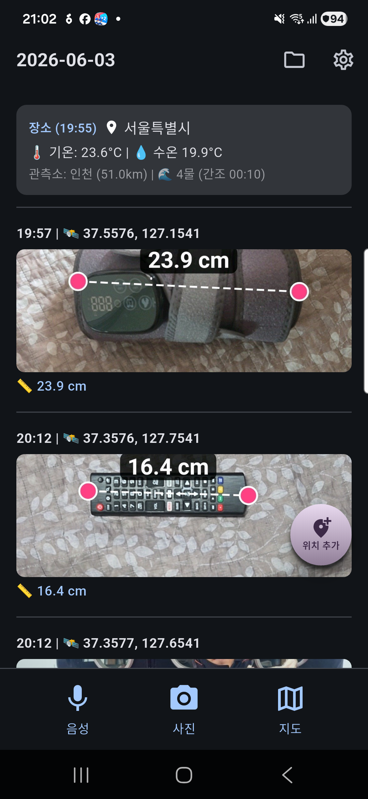
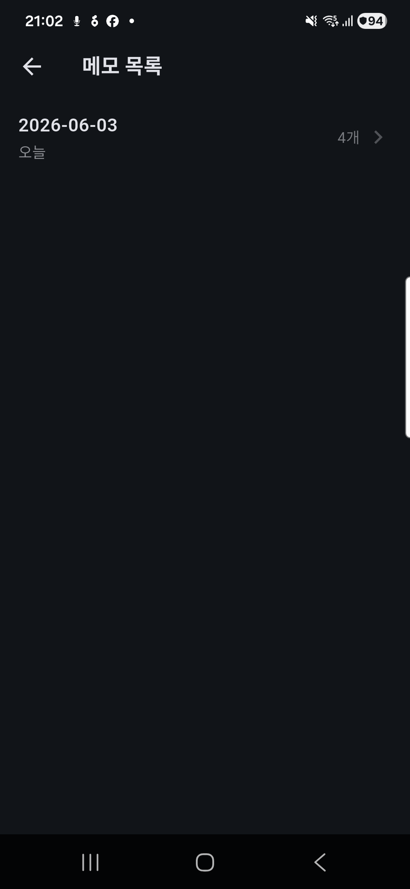
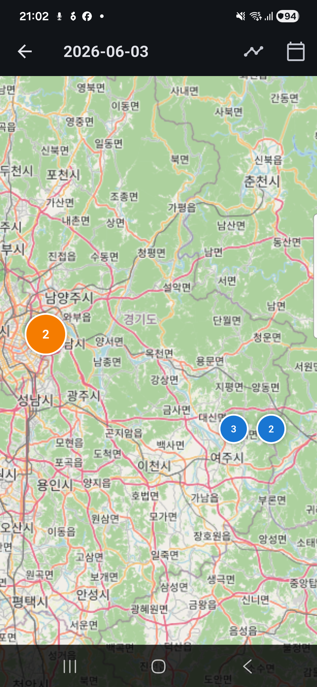
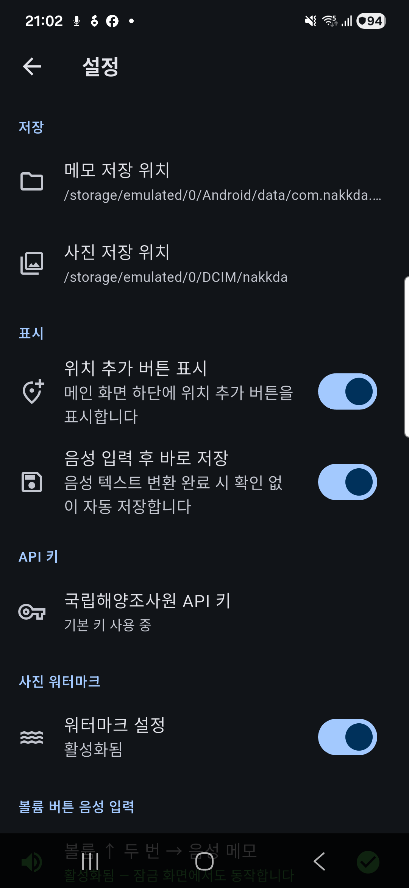

# 낚.다 (NAKK.DA)

낚시 현장에서 바로 쓰는 메모 앱. 음성 메모, 사진 촬영, GPS 기록, 물때·날씨 정보를 하나의 앱에서 관리합니다.

---

## 스크린샷

| 홈 화면 | 파일 목록 | 지도 | 설정 |
|:---:|:---:|:---:|:---:|
|  |  |  |  |

---

## 주요 기능

| 기능 | 설명 |
|------|------|
| **음성 메모** | 화면을 켜지 않아도 볼륨 버튼으로 음성 인식 트리거, Foreground Service로 백그라운드 동작 |
| **사진 메모** | 일반 카메라(줄자 사진) / AR 카메라(ARCore 실측) / 갤러리 선택 3가지 입력 방식 |
| **워터마크** | 날짜·시간·커스텀 텍스트를 사진에 합성, 위치·폰트·크기·투명도 설정 가능 |
| **GPS 기록** | 메모마다 위도·경도 자동 첨부, 물고기 길이(cm) 별도 기록 |
| **현황 블록** | 기온·수온·물때·관측소 정보를 메모 파일에 실시간 삽입 |
| **지도 보기** | GPS가 첨부된 메모를 flutter_map으로 마커 클러스터링하여 표시 |
| **파일 목록** | 날짜별 메모 파일(.md) 목록 및 전체 검색 |
| **저장 경로** | DCIM/nakkda (앱 삭제 후에도 유지) / 앱 전용 저장소 자동 선택 |

---

## 기술 스택

- **Flutter** 3.x (Android 전용)
- **Kotlin** — AR 카메라 Activity, Foreground Service, MediaStore 저장
- **ARCore** — 실세계 거리 측정 (AR 카메라)
- **Riverpod** — 상태 관리 (AsyncNotifier 패턴)
- **go_router** — 선언적 라우팅
- **flutter_map + latlong2** — 지도 표시
- **speech_to_text** — 음성 인식
- **camera** — 일반 카메라 프리뷰 / 촬영
- **flutter_image_compress** — 워터마크 이미지 처리
- **MediaStore API** — Android 10+ 갤러리 저장

---

## 개발 환경

| 항목 | 버전 |
|------|------|
| Flutter SDK | ^3.11.4 |
| Dart SDK | ^3.11.4 |
| Android minSdk | 26 (Android 8.0) |
| Android targetSdk | 36 (Android 16) |
| ARCore | 필수 (AR 카메라 기능) |

### 사전 준비

```bash
# Flutter SDK 설치 후
flutter pub get
```

### API 키 설정

`lib/core/constants/api_keys.dart` 에 [data.go.kr](https://www.data.go.kr) 공공데이터포털 API 키를 입력합니다.

```dart
// 국립해양조사원 조위관측 API 키 (디코딩 키)
const String kDefaultKhoaApiKey = '발급받은_키_입력';
```

> API 키는 [국립해양조사원 바다누리 API](https://www.khoa.go.kr/api/oceangrid/tideObsPreTab/search.do) 에서 발급받을 수 있습니다.

---

## 빌드

```bash
# 디버그 APK
flutter build apk --debug

# 릴리즈 APK
flutter build apk --release
```

---

## 앱 구조

```
lib/
├── app.dart                      # MaterialApp 루트
├── main.dart                     # 앱 진입점
├── core/
│   ├── constants/                # API 키, 앱 상수
│   ├── router/                   # go_router 라우팅
│   ├── services/                 # AR, 접근성 서비스 브릿지
│   ├── theme/                    # 앱 테마
│   ├── utils/                    # 워터마크, 미디어스캐너, 날짜 포매터
│   └── widgets/                  # 공통 위젯
└── features/
    ├── file_list/                # 메모 파일 목록 / 뷰어
    ├── location/                 # GPS·역지오코딩·날씨·물때
    ├── map/                      # 지도 화면
    ├── memo/                     # 메모 CRUD, 직렬화(.md)
    ├── permission/               # 권한 요청 화면
    ├── photo/                    # 카메라·갤러리 촬영
    ├── settings/                 # 앱 설정 (저장 경로, 워터마크)
    ├── tide/                     # 물때 API 서비스
    └── weather/                  # 날씨 API 서비스

android/app/src/main/kotlin/com/nakkda/nakkda/
├── MainActivity.kt               # Flutter 진입점, MediaStore 저장 채널
├── ArMeasureActivity.kt          # AR 카메라 (ARCore + OpenGL)
├── ArDotsOverlayView.kt          # AR 측정 점 오버레이
├── VoiceRecordForegroundService.kt  # 볼륨 버튼 감지 + 음성 인식
├── VoiceRecordAccessibilityService.kt # 접근성 서비스 (보조)
├── BackgroundRenderer.kt         # ARCore 배경 렌더러
└── DisplayRotationHelper.kt      # AR 디스플레이 회전 보조
```

---

## 메모 저장 형식

메모는 날짜별 마크다운(`.md`) 파일로 저장됩니다.

```markdown
# 2026-06-03

## 현황
- 📍 인천광역시 중구
- 🌡 기온: 22°C | 💧 수온 18°C
- 관측소: 인천 (2.1km) | 🌊 5물 (만조 18:03)

---

### 14:32 | 🛰 37.4563, 126.7051

- 📏 42.5cm
```

---

## 권한

| 권한 | 용도 |
|------|------|
| 마이크 | 음성 메모 녹음 |
| 위치 | GPS 좌표 기록 |
| 카메라 | 사진 촬영 |
| 사진/미디어 | 갤러리 접근 |
| 알림 | Foreground Service 알림 표시 |
| 전체 파일 접근 | DCIM/nakkda 영구 저장 (선택) |

---

## 문서

- [아키텍처](docs/architecture.md)
- [기능 상세](docs/features.md)
- [API 키 설정](docs/api_setup.md)
