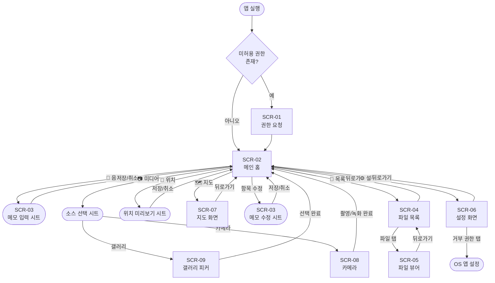

# 화면 설계서: vo-rec

**버전:** 2.1  
**최초 작성:** 2026-06-02  
**최종 수정:** 2026-06-06  
**플랫폼:** Android (Flutter)

---

## 1. 전체 화면 목록

| 화면 ID | 화면 이름 | 한 줄 설명 |
|---------|----------|-----------|
| SCR-01 | 권한 요청 화면 | 앱 최초 실행 시 마이크·위치·카메라·저장소 권한을 순차 안내하고 요청 |
| SCR-02 | 메인(홈) 화면 | 오늘 메모 현황을 표시하고 음성·사진·위치·지도를 원탭으로 실행하는 핵심 화면 |
| SCR-03 | 메모 입력 시트 | 텍스트/음성 메모 작성, 사진/동영상 첨부, 기존 메모 수정 바텀시트 |
| SCR-04 | 파일 목록 화면 | 날짜 내림차순으로 저장된 .md 파일을 목록으로 표시 |
| SCR-05 | 파일 뷰어 화면 | 선택한 하루치 .md 파일의 내용 표시 |
| SCR-06 | 설정 화면 | 저장 경로(메모/사진)·버튼 표시·API 키·권한 상태를 관리 |
| SCR-07 | 지도 화면 | 날짜별 GPS 지점을 지도에 표시, 경로 연결 및 마커 클러스터링 |
| SCR-08 | 카메라 화면 | 사진/동영상 모드 전환, 해상도 선택, 촬영/녹화 |
| SCR-09 | 갤러리 피커 화면 | 전체/사진/동영상 탭 필터링이 가능한 커스텀 갤러리 선택 화면 |

---

## 2. 화면별 상세 명세

---

### SCR-01 | 권한 요청 화면

(초기 설계와 동일, 생략)

---

### SCR-02 | 메인(홈) 화면

#### 주요 변경사항 (v2.0)

- 하단 액션 바에 **지도** 버튼 추가 (4번째)
- 위치 추가 버튼: 확인 팝업 제거 → 데이터 수집 후 미리보기 시트로 변경
- 항목 왼쪽 스와이프 → 수정/삭제 버튼 노출

#### 주요 UI 컴포넌트

```
┌─────────────────────────────────┐
│ vo-rec          2026년 6월 3일   │  AppBar
│                      [📁] [⚙]   │
├─────────────────────────────────┤
│                                 │
│  ┌─────────────────────────┐   │  현황 블록 카드
│  │ 이동 (14:30)             │   │
│  │ 📍 경남 통영시 미수동    │   │
│  │ 🌡 22.5°C | 🌊 5물 ...  │   │
│  └─────────────────────────┘   │
│                                 │
│  ┌─────────────────────────┐   │  메모 카드 (왼쪽 스와이프 시)
│  │ 14:35 | 🛰 34.8540, ... │   │  ┌──────┬──────┐
│  │ 감성돔 노림. 조류 약하고  │   │  │ 수정 │ 삭제 │
│  └─────────────────────────┘   │  └──────┴──────┘
│                                 │
├─────────────────────────────────┤
│ ┌────┐  ┌────┐  ┌────┐  ┌────┐ │  하단 액션 바
│ │ 🎤 │  │ 📷 │  │ 📍 │  │ 🗺 │ │
│ │음성│  │사진│  │위치│  │지도│ │
│ └────┘  └────┘  └────┘  └────┘ │
└─────────────────────────────────┘
```

#### 위치 추가 흐름 (v2.0)

```
위치 추가 탭
    → 로딩 스낵바 ("환경 정보 수집 중...")
    → GPS + 역지오코딩 + 기온 + 물때 병렬 수집
    → 미리보기 시트 표시
        ┌─────────────────────────┐
        │ 위치 정보 확인           │
        │ ┌───────────────────┐  │
        │ │ LocationStatusCard│  │  수집된 데이터 미리보기
        │ └───────────────────┘  │
        │         [취소]  [저장]  │
        └─────────────────────────┘
    → 저장 / 취소
```

#### 사용자 액션과 결과

| 액션 | 결과 |
|------|------|
| 🎤 음성 버튼 탭 | SCR-03 메모 입력 시트 (음성 모드) |
| 📷 사진 버튼 탭 | 카메라/갤러리 선택 → 촬영/선택 → MediaStore 저장 |
| 📍 위치 버튼 탭 | 환경 정보 수집 → 미리보기 시트 → 저장/취소 |
| 🗺 지도 버튼 탭 | SCR-07 지도 화면 |
| 항목 왼쪽 스와이프 | 수정/삭제 버튼 노출 |
| 수정 버튼 탭 | SCR-03 메모 수정 시트 |
| 삭제 버튼 탭 | 확인 팝업 → 삭제 |

---

### SCR-03 | 메모 입력 시트

#### 주요 변경사항 (v2.1)

- **미디어 첨부**: 사진/동영상 통합 "미디어 추가" 섹션 (기존 사진 전용 섹션 대체)
  - 동영상 첨부 시 썸네일 + 재생 아이콘 표시, 탭으로 전체화면 재생
  - 소스 선택: AR 길이 측정 / 카메라(사진·동영상 통합) / 갤러리

#### 주요 변경사항 (v2.0)

- 음성 입력: **길게 누르기** → **탭 토글** (탭하면 시작, 재탭 또는 3초 침묵 시 종료)
- 음성 인식 중 실시간 미리보기 텍스트(회색 이탤릭) 버튼 위에 표시
- 수정 모드: GPS 좌표 편집 행 표시 (위도/경도 직접 입력, 현재 위치로 갱신 버튼)
- 수정 모드에서 text가 비어있어도 저장 가능 (사진 메모 GPS 수정 지원)

#### 주요 UI 컴포넌트

```
┌─────────────────────────────────┐
│ ▬ (드래그 핸들)                  │
│                                 │
│ ┌─────────────────────────────┐ │
│ │ (텍스트 입력 / 수정)          │ │  minLines: 5
│ │                             │ │  힌트: "메모를 입력하거나 🎤 버튼을 누르세요"
│ └─────────────────────────────┘ │
│                                 │
│ [수정 모드일 때만]                │
│ ┌────┐ [위도 입력] [경도 입력] 📍 ✕ │  GPS 편집 행
│                                 │
│ 실시간 미리보기 텍스트 (회색)      │  음성 인식 중일 때만 표시
│                                 │
│  [🎤 탭으로 시작/종료]  [취소] [저장] │
└─────────────────────────────────┘
```

**음성 인식 동작:**

| 상태 | 버튼 색상 | 미리보기 |
|------|---------|---------|
| idle | 기본 | 없음 |
| listening | 빨간 테두리 | 회색 이탤릭 실시간 텍스트 |
| 종료 후 | 기본 | 없음 (최종 결과 텍스트 필드에 삽입) |

---

### SCR-04 | 파일 목록 화면

(초기 설계와 동일)

---

### SCR-05 | 파일 뷰어 화면

(초기 설계와 동일)

---

### SCR-06 | 설정 화면

#### 주요 변경사항 (v2.0)

- **메모 저장 위치** (기존 "저장 위치" 항목)
- **사진 저장 위치** 항목 추가 (기본값: DCIM/vo_rec)
- **KHOA API 키** 항목 추가

#### 주요 UI 컴포넌트

```
┌─────────────────────────────────┐
│ ←   설정                        │
├─────────────────────────────────┤
│                                 │
│  저장                            │  섹션
│  ┌─────────────────────────┐   │
│  │ 📁 메모 저장 위치         │   │  탭 → 경로 변경 다이얼로그
│  │ /storage/emulated/...   │   │
│  └─────────────────────────┘   │
│  ┌─────────────────────────┐   │
│  │ 🖼 사진 저장 위치         │   │  탭 → 경로 변경 다이얼로그
│  │ /storage/.../DCIM/vo_rec│   │  기본: DCIM/vo_rec (갤러리 표시)
│  └─────────────────────────┘   │
│                                 │
│  표시                            │  섹션
│  ┌─────────────────────────┐   │
│  │ 위치 추가 버튼           [○] │  SwitchListTile
│  └─────────────────────────┘   │
│                                 │
│  API 키                          │  섹션
│  ┌─────────────────────────┐   │
│  │ 🔑 KHOA API 키          │   │  탭 → API 키 입력 다이얼로그
│  │ 기본 키 사용 중          │   │  비워두면 내장 기본 키 사용
│  └─────────────────────────┘   │
│                                 │
│  권한                            │  섹션
│  [마이크] [위치] [카메라] [저장소]│
└─────────────────────────────────┘
```

---

### SCR-07 | 지도 화면

#### 목적

날짜별 GPS 기록 지점을 OpenStreetMap 위에 시각화한다. 지점 간 경로를 연결하거나 개별 지점의 메모 내용을 확인할 수 있다.

#### 진입 조건

- SCR-02 메인 화면 하단 🗺 지도 버튼 탭

#### 주요 UI 컴포넌트

```
┌─────────────────────────────────┐
│ ←  2026-06-03   [경로🗺] [📅]   │  AppBar
│                                 │  경로 버튼: 지점 2개↑일 때 표시
├─────────────────────────────────┤
│                                 │
│      [OpenStreetMap 지도]        │
│                                 │
│   ①  ②  ③                      │  개별 마커 (파란/청록 원 + 번호)
│                                 │  클러스터: 주황 원 + 개수 ("3")
│   ①────②────③                  │  경로 연결 ON 시 파란 선
│                                 │
├─────────────────────────────────┤
│ [마커 선택 시 팝업]               │  시스템 네비게이션 바 위
│ ┌─────────────────────────┐    │
│ │ 🗨 14:35          ✕    │    │  헤더: 타입 아이콘 + 시각 + 닫기
│ │ 📍 경남 통영시 미수동   │    │
│ │ [사진 썸네일 - 있을 때] │    │
│ │ 메모 텍스트...          │    │
│ │ 📏 38.5cm              │    │
│ │           [연결/연결해제]│    │
│ └─────────────────────────┘    │
└─────────────────────────────────┘
```

#### 마커 종류

| 종류 | 색상 | 내용 |
|------|------|------|
| 메모 마커 | 파랑 | 텍스트 메모 또는 사진 메모 |
| 위치 마커 | 청록 | 현황 블록 (위치 추가) |
| 클러스터 마커 | 주황 | 근접 지점 묶음 + 개수 |
| 선택된 마커 | 주황 테두리 + 확대 | 현재 선택 상태 |

#### 클러스터링 동작

| 줌 레벨 | 클러스터 반경 |
|---------|-------------|
| 15 | ~33m |
| 14 | ~67m |
| 12 | ~267m |
| 10 | ~1km |

- 줌 0.5 단위 변화마다 재계산
- 클러스터 탭 → 해당 지점 bounds로 확대
- 충분히 줌인 시 개별 마커 자동 분리

#### 경로 연결

- AppBar 경로 버튼 탭 → 모든 지점 시간순 파란 선 연결
- 재탭 → 선 제거
- 버튼 색상으로 on/off 상태 표시 (on: Primary 색상)
- 날짜 변경 시 경로 연결 상태 초기화

#### 날짜 선택

- AppBar 📅 버튼 탭 → DatePicker
- 선택한 날짜 데이터로 지도 갱신
- 새 날짜의 모든 지점이 화면에 들어오도록 카메라 자동 조정

#### 사용자 액션과 결과

| 액션 | 결과 |
|------|------|
| 마커 탭 | 하단 팝업 표시 |
| 클러스터 탭 | 클러스터 지점들로 확대 |
| 지도 빈 곳 탭 | 팝업 닫기 |
| 경로 버튼 탭 | 경로 선 on/off 토글 |
| 날짜 버튼 탭 | DatePicker → 해당 날짜 데이터 로드 |

---

### SCR-08 | 카메라 화면

#### 목적

사진 촬영 및 동영상 녹화. 하단 탭 또는 좌우 스와이프로 모드를 전환한다.

#### 진입 조건

- SCR-02/03 미디어 소스 선택 시트 → "카메라" 선택

#### 주요 UI 컴포넌트

```
┌─────────────────────────────────┐
│ ←          [● REC 00:12]   720p │  동영상 모드·녹화 중일 때 타이머·해상도 버튼
├─────────────────────────────────┤
│                                 │
│       [카메라 프리뷰]             │  핀치 줌 / 탭 포커스
│                                 │
│                    [💧]         │  사진 모드: 워터마크 토글
│                                 │
├─────────────────────────────────┤
│      [사진]        [동영상]       │  모드 탭 (스와이프로도 전환)
│                                 │
│          ┌──────────┐           │
│          │ ● or ■   │           │  사진: 흰 원 / 동영상: 빨간 원→사각형
│          └──────────┘           │
└─────────────────────────────────┘
```

#### 모드별 동작

| 모드 | 버튼 | 결과 |
|------|------|------|
| 사진 | 흰 원 탭 | 촬영 후 사진 경로 반환 |
| 동영상 (대기) | 빨간 원 탭 | 녹화 시작, 타이머 표시 |
| 동영상 (녹화 중) | 빨간 사각형 탭 | 녹화 종료, 앱 스토리지에 저장 후 경로 반환 |

#### 동영상 해상도

상단 `720p/1080p` 버튼으로 전환. 선택값은 `SharedPreferences`에 저장되어 유지됨.

---

### SCR-09 | 갤러리 피커 화면

#### 목적

기기 갤러리에서 사진 또는 동영상을 선택한다. 탭 필터로 유형을 구분한다.

#### 진입 조건

- SCR-02/03 미디어 소스 선택 시트 → "갤러리" 선택

#### 주요 UI 컴포넌트

```
┌─────────────────────────────────┐
│ ←   갤러리                       │
│  [  전체  ] [  사진  ] [동영상]   │  TabBar
├─────────────────────────────────┤
│ [썸네일] [썸네일] [썸네일🎬]     │
│ [썸네일] [썸네일🎬] [썸네일]     │  3열 그리드, 동영상엔 ▶ 아이콘
│  ...                            │
└─────────────────────────────────┘
```

#### 권한 상태별 처리

| 상태 | 화면 |
|------|------|
| 정상 | 그리드 표시 |
| 동영상 권한 없음 | 안내 메시지 + [설정 열기] + [다시 시도] |
| 부분 접근(limited) | 경고 메시지 + [설정 열기] |
| 완전 거부 | 안내 메시지 + [설정 열기] |

---

## 3. 네비게이션 플로우



---

## 4. 공통 컴포넌트

| 컴포넌트 | 위치 | 설명 |
|---------|------|------|
| `ActionButton` | `core/widgets/` | 메인 하단 액션 버튼 |
| `MemoEntryCard` | `core/widgets/` | 단일 메모 표시 (타임스탬프·GPS·텍스트·사진·동영상·길이) |
| `VideoPlayerWidget` | `core/widgets/` | 동영상 썸네일 표시 + 탭으로 전체화면 재생 |
| `GalleryPickerScreen` | `core/screens/` | 전체/사진/동영상 탭 필터링 갤러리 선택 화면 |
| `LocationStatusCard` | `core/widgets/` | 현황 블록 표시 (주소·기온·물때·수온·관측소) |
| `PermissionStatusChip` | `core/widgets/` | 권한 상태 칩 (허용/거부) |
| `ConfirmDialog` | `core/widgets/` | 범용 확인 팝업 |
| `EmptyStateView` | `core/widgets/` | 빈 목록 안내 위젯 |
